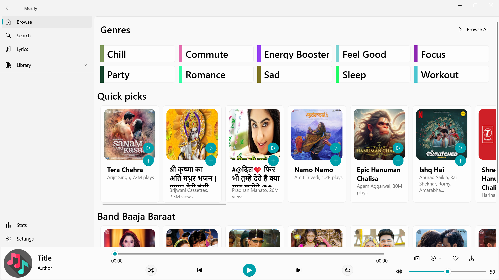
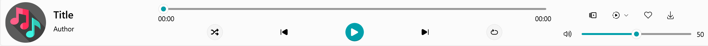
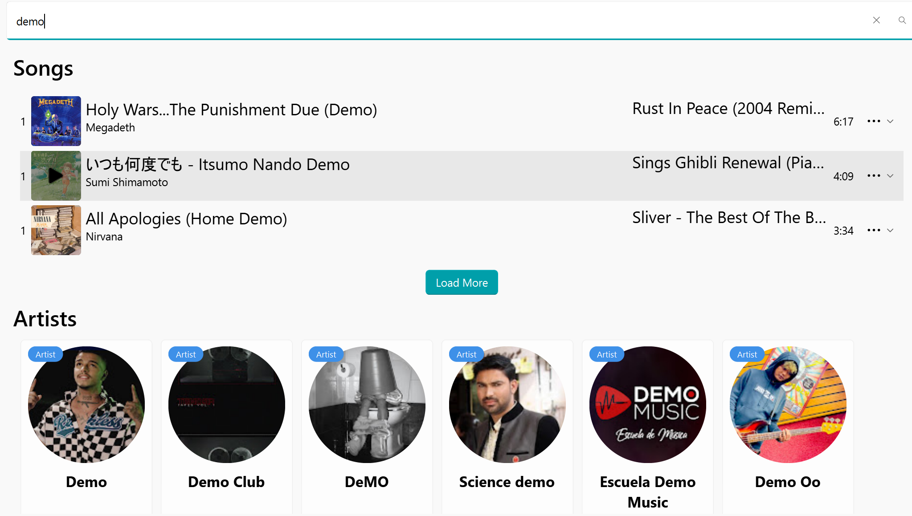
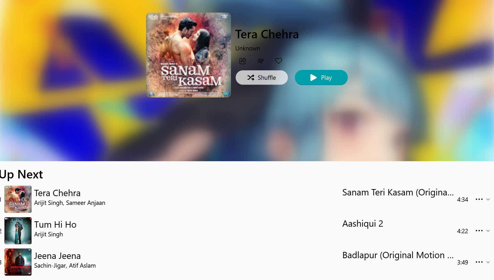
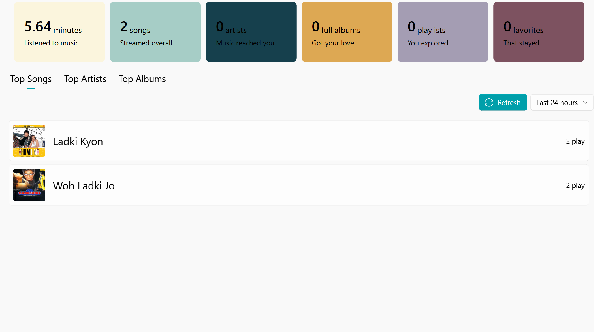
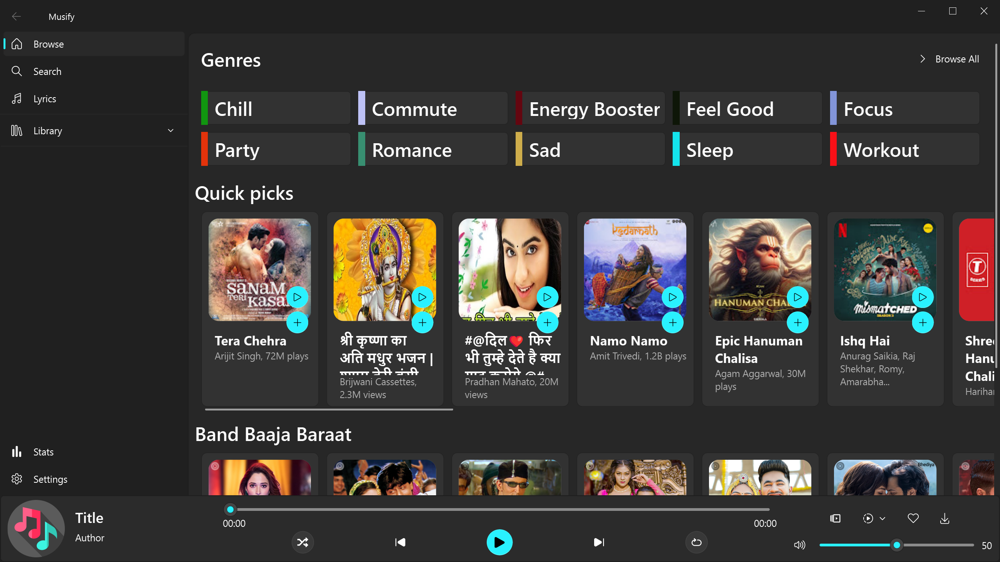

# BeatRoot- Modern Music Player Application


\
Musify is a feature-rich cross-platform music player application with modern UI design, combining local music library management with online streaming capabilities through YouTube Music integration, completely build using python.

## Features ✨

### Core Functionality
- **Music Playback**
  - Play/pause control
  - Next/previous track navigation
  - Shuffle and repeat modes
  - Queue management
  - Lyrics display
  - Track progress bar

### Library Management
- Local music library organization
- Playlist management (create/edit/delete)
- Artist/album categorization
- Recent plays history
- Favorites/liked tracks system

### Online Integration
- YouTube Music streaming
- Search across YT Music catalog
- Genre-based browsing
- Playlist/album/artist exploration
- Watch playlist generation

### UI/UX Features
- Fluent Design System interface
- Responsive layout
- Acrylic effects and animations
- Dark/light theme support
- Customizable navigation pane
- Multiple view modes
- Context menus and dialogs

### Advanced Features
- Background data fetching
- Asynchronous operations
- Database persistence (SQLite)
- Network connectivity checks
- Error handling and logging
- Cross-platform compatibility

### Your Stats
- Play time
- Song played
- Playlist Played
- Artist View
- Full Album Browser
- Fav/Liked Songs

### Tracking
- Top Songs
- Top Artists
- Top Albums

## Installation 🛠️

### Prerequisites
- Python 3.9+
- pip package manager

### Dependencies
```bash
pip install PySide6 qfluentwidgets ytmusicapi loguru mutagen python-vlc ytdlp qsaync, aiosqlite
```

### Repository Links
- [QFluentWidgets](https://github.com/zhiyiYo/QFluentWidgets)
- [qasync](https://github.com/CabbageDevelopment/qasync)
- [loguru](https://github.com/Delgan/loguru)
- [ytmusicapi](https://github.com/sigma67/ytmusicapi)
- [yt-dlp](https://github.com/yt-dlp/yt-dlp)
- [python-vlc](https://github.com/videolan/vlc)

### Getting Started
1. Clone the repository:
```bash
git clone https://github.com/dontknow492/BeatRoot.git
cd BeatRoot
```

2. Install requirements:
```bash
pip install -r requirements.txt
```

3. Run the application:
```bash
python main.py
```

## Project Structure 📁
```
musify/
├── data/
│   ├── app/          # JSON data templates
│   └── user/         # User data and database
├── src/
│   ├── api/          # YouTube Music API integration
│   ├── common/       # Shared common widget
    ├── components/   # Components like cards, dialog, etc
│   ├── interfaces/   # UI views and widgets
│   └── utility/      # Helper functions and managers
├── main.py           # Main application entry
└── README.md
```

## Configuration ⚙️
Create `config.json` with YouTube Music authentication:
```json
{
  "YTMusic": {
    "auth": "your_oauth_credentials",
    "user_id": "your_user_id"
  }
}
```

## Usage 🎮
1. **Navigation**
   - Use the sidebar to switch between views
   - Right-click items for context menus
   - Drag window edges for responsive layout

2. **Music Playback**
   - Double-click tracks to play
   - Use bottom player controls
   - Right-click player for advanced options

3. **Search**
   - Global search bar in header
   - Supports artists/albums/tracks
   - Instant results with previews

4. **Library Management**
   - Import local folders through Local interface
   - Create smart playlists
   - View listening statistics

## Development 🧑💻

### Code Architecture
- **Main Components**
  - `MainWindow`: Root application window
  - `ViewManager`: Dynamic view management
  - `PlayerInterface`: Playback controls
  - `DatabaseManager`: SQLite operations
  - `DataFetcherWorker`: Background API calls

### Key Patterns
- Model-View-Controller (MVC)
- Observer pattern for signals/slots
- Asynchronous programming with Qasync
- Worker thread for API operations
- Worker thread for downloading Songs
- QNetworkManager for async thumbnail downloading

### Extending Functionality
1. Add new interfaces:
```python
class NewInterface(ViewInterface):
    def __init__(self, parent=None):
        super().__init__(parent)
        # Add custom components
```

2. Register in navigation:
```python
self.addSubInterface(self.newInterface, FluentIcon.ADD, "New Feature")
```

## License 📄
This project is currently unlicensed. Please contact the author for licensing information.

## Contributing 🤝
Contributions are welcome! Please follow:
1. Fork the repository
2. Create your feature branch
3. Commit changes with descriptive messages
4. Push to the branch
5. Open a pull request

## Screenshots 📸

#### Home view showing featured content


#### Compact bottom player controls 


#### Search any music 


#### View play playlist, artist, releated songs


#### Elignent and real time lyrics 


#### Get your stats, usage reports, top song, artist, etc 



#### Dark theme appearance



## Support ❤️
If you find this project useful, please consider:
- ⭐ Starring the repository
- 🐛 Reporting issues
- 💡 Suggesting new features
- 🖋️ Writing documentation

---
**Note:** This application is under active development. Some features may be experimental, not work so please be patient, i am trying my full to complete so hope you like it.

**Important:** This application use *vlc pluging* and *vlc dlls* to play the song, stream it so huge thanks to vlc for this and i wanted it able to play without needing of vlc in system so i used vlc plugin, dll for it.
